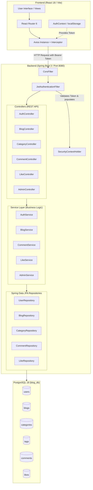
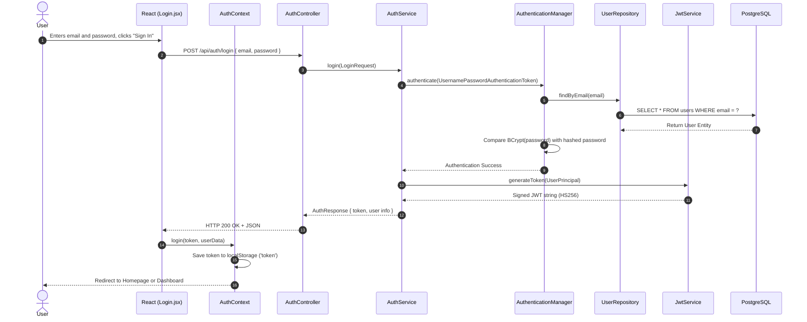
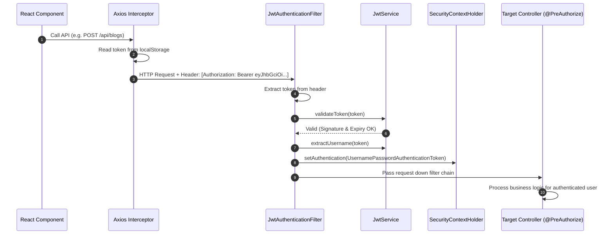
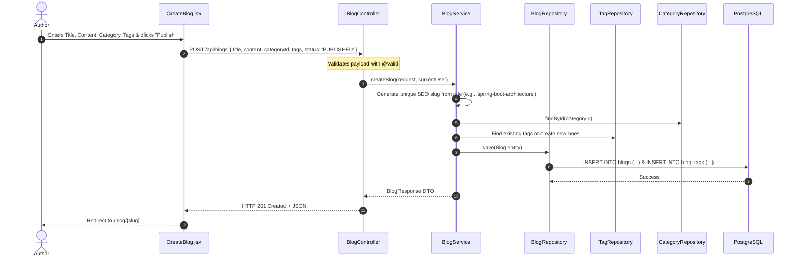
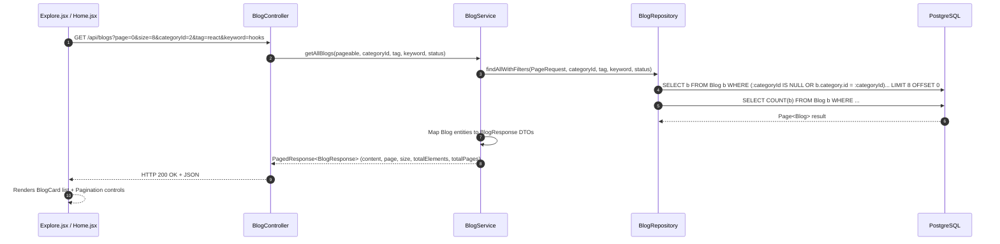
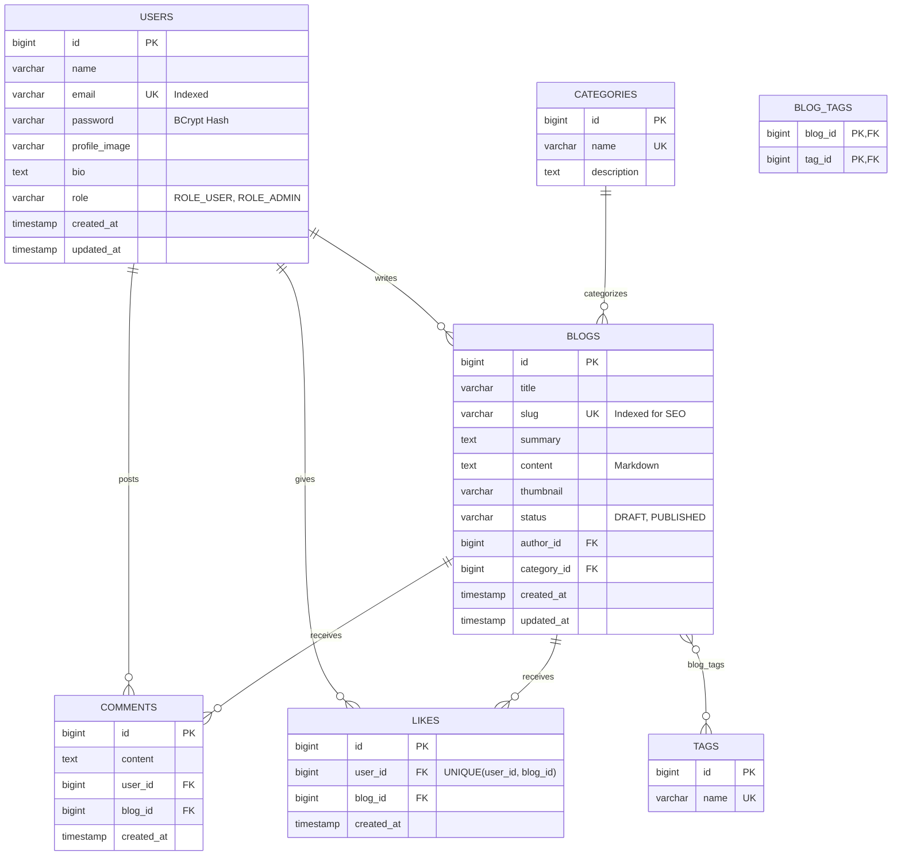

# 🧭 BlogSpace — Complete Project Architecture & Execution Flow Guide

Welcome to the **BlogSpace** comprehensive architecture guide. This document was created to give you a complete, clear, and end-to-end understanding of how this entire Full-Stack system works—from the browser click down to the PostgreSQL database queries.

Whether you are revising before an interview, presenting this project to a hiring manager, or expanding its features, this single guide walks you through every layer, flow, and design pattern used.

---

## 📑 Table of Contents

1. [High-Level Architecture & Tech Stack](#1-high-level-architecture--tech-stack)
2. [End-to-End System Architecture Diagram](#2-end-to-end-system-architecture-diagram)
3. [The Core Request-Response Flows (Step-by-Step)](#3-the-core-request-response-flows-step-by-step)
   - [Flow 1: User Registration & Authentication (JWT Flow)](#flow-1-user-registration--authentication-jwt-flow)
   - [Flow 2: Authenticated API Requests (Token Interceptor Flow)](#flow-2-authenticated-api-requests-token-interceptor-flow)
   - [Flow 3: Creating and Publishing an Article](#flow-3-creating-and-publishing-an-article)
   - [Flow 4: Browsing, Searching & Filtering (Pagination Flow)](#flow-4-browsing-searching--filtering-pagination-flow)
   - [Flow 5: Social Engagement (Like Toggle & Comments)](#flow-5-social-engagement-like-toggle--comments)
   - [Flow 6: Role-Based Admin Management](#flow-6-role-based-admin-management)
4. [Backend Deep Dive (Spring Boot 3)](#4-backend-deep-dive-spring-boot-3)
   - [Package Structure](#backend-package-structure)
   - [Layer-by-Layer Responsibilities](#layer-by-layer-responsibilities)
   - [Key Backend Classes Explained](#key-backend-classes-explained)
5. [Database Schema & ER Model (PostgreSQL 18)](#5-database-schema--er-model-postgresql-18)
6. [Frontend Deep Dive (React 18 + Tailwind CSS)](#6-frontend-deep-dive-react-18--tailwind-css)
   - [Component Hierarchy](#frontend-component-hierarchy)
   - [State & Context Management](#state--context-management)
   - [API Service Layer & Axios Interceptors](#api-service-layer--axios-interceptors)
7. [Security Architecture Explained](#7-security-architecture-explained)
8. [Interview Mastery: How to Pitch & Defend This Project](#8-interview-mastery-how-to-pitch--defend-this-project)

---

## 1. High-Level Architecture & Tech Stack

BlogSpace is engineered using a **decoupled Client-Server architecture**:

```text
┌─────────────────────────────────┐           HTTP REST / JSON           ┌─────────────────────────────────┐
│        REACT 18 FRONTEND        │  ◄────────────────────────────────►  │      SPRING BOOT 3 BACKEND      │
│  - Vite + React Router 6        │      Authorization: Bearer <JWT>     │  - Spring Security 6 (Stateless)│
│  - Tailwind CSS (Editorial UI)  │                                      │  - Spring Data JPA (Hibernate)  │
│  - Axios Client + Context API   │                                      │  - PostgreSQL 18 Driver         │
└─────────────────────────────────┘                                      └────────────────┬────────────────┘
                                                                                          │
                                                                                 JDBC / SQL Queries
                                                                                          ▼
                                                                         ┌─────────────────────────────────┐
                                                                         │      POSTGRESQL 18 DATABASE     │
                                                                         │  - 7 relational tables          │
                                                                         │  - Foreign keys & constraints   │
                                                                         └─────────────────────────────────┘
```

### Technology Breakdown

| Layer | Technology | Key Responsibility |
| :--- | :--- | :--- |
| **Frontend** | React 18, Vite | Component-driven UI, client-side routing, optimistic UX |
| **Styling** | Tailwind CSS | Modern typography (Newsreader/Lora/Inter), clean spacing |
| **HTTP Client** | Axios | Request/Response interceptors, JWT injection |
| **Backend** | Spring Boot 3.3.4, Java 21 | RESTful controllers, business logic, validation |
| **Security** | Spring Security 6, JJWT 0.12.6 | Stateless authentication, BCrypt, RBAC |
| **Persistence** | Spring Data JPA, Hibernate ORM | Entity mapping, JPQL queries, pagination |
| **Database** | PostgreSQL 18 | ACID-compliant storage, relational integrity |

---

## 2. End-to-End System Architecture Diagram



---

## 3. The Core Request-Response Flows (Step-by-Step)

Here is exactly what happens behind the scenes during every major operation in the application:

---

### Flow 1: User Registration & Authentication (JWT Flow)



1. **User input**: User submits credentials on `/login`.
2. **REST Call**: `axios.post('/auth/login', { email, password })`.
3. **AuthenticationManager**: Delegates to `UserDetailsServiceImpl`, which queries `UserRepository.findByEmail()`.
4. **Password Verification**: `PasswordEncoder.matches(rawPassword, encodedPassword)` securely tests the hash.
5. **Token Minting**: `JwtService` creates a token containing user email, user ID, role (`ROLE_USER` or `ROLE_ADMIN`), issued timestamp, and 24-hour expiration.
6. **Storage**: React saves the token in browser `localStorage` and updates `AuthContext` state so all components instantly know the user is logged in.

---

### Flow 2: Authenticated API Requests (Token Interceptor Flow)

Whenever an authenticated user performs an action (e.g., writes a story, posts a comment, likes a post):



- **Axios Interceptor**: Located in [frontend/src/api/axios.js](file:///w:/Spring%20Boot%20Projects/blog-application/frontend/src/api/axios.js). Before any HTTP request leaves the browser, the interceptor checks `localStorage.getItem('token')` and appends `Authorization: Bearer <token>`.
- **JwtAuthenticationFilter**: Located in [backend/src/main/java/com/blog/security/JwtAuthenticationFilter.java](file:///w:/Spring%20Boot%20Projects/blog-application/backend/src/main/java/com/blog/security/JwtAuthenticationFilter.java). It runs once per request, extracts the JWT, verifies the HMAC-SHA256 signature, builds a `UserPrincipal`, and populates Spring's `SecurityContextHolder`.

---

### Flow 3: Creating and Publishing an Article



**Key Business Rules in `BlogService`**:
- **Automatic Slug Generation**: Automatically converts `"Mastering Spring Boot 3!"` into `"mastering-spring-boot-3"`. If a blog with that slug already exists, it appends a timestamp/UUID to guarantee uniqueness.
- **Tag Upsert**: Tags are reused if they already exist in the database, or dynamically created if new.
- **Author Binding**: The author is automatically extracted from the authenticated user's session—a user cannot forge the author ID.

---

### Flow 4: Browsing, Searching & Filtering (Pagination Flow)

The Home and Explore pages display high-performance paginated lists:



- **Efficiency**: Rather than loading thousands of blogs into memory, the database handles `LIMIT 8 OFFSET 0`.
- **Dynamic Filtering**: The SQL query dynamically accommodates any combination of category, tag, search query, or status.

---

### Flow 5: Social Engagement (Like Toggle & Comments)

#### Like Toggle Flow (Idempotent / Prevents Duplicates)
- Endpoint: `POST /api/blogs/{blogId}/like`
- `LikeService` executes within a `@Transactional` block:
  1. Checks if a record exists in `likes` table with `user_id = ? AND blog_id = ?`.
  2. **If found**: Deletes the record (Unlikes) -> returns `isLiked = false`.
  3. **If not found**: Inserts a new `Like` record (Likes) -> returns `isLiked = true`.
- The database enforces a `UNIQUE(user_id, blog_id)` constraint, making race conditions impossible.

#### Comment Flow
- Endpoint: `POST /api/blogs/{blogId}/comments`
- Persists content with user foreign key and blog foreign key.
- Anyone can read comments; only authenticated users can post; only the comment author or an Admin can delete.

---

### Flow 6: Role-Based Admin Management

- **Frontend Guard**: `<AdminRoute>` checks `user.role === 'ROLE_ADMIN'`. If a regular user tries navigating to `/admin`, they are redirected to `/`.
- **Backend Guard**: Methods in `AdminController` and administrative methods in `CategoryController` are secured via `@PreAuthorize("hasRole('ADMIN')")`.
- **Capabilities**:
  - View real-time platform metrics (User count, Blog count, Draft count, Total comments, Total likes).
  - Manage (create/update/delete) categories.
  - Delete any story or comment that violates community guidelines.
  - Manage user accounts.

---

## 4. Backend Deep Dive (Spring Boot 3)

### Backend Package Structure

```text
com.blog
├── BlogApplication.java              # Spring Boot Main Entry Point
├── config/
│   ├── SecurityConfig.java           # SecurityFilterChain, PasswordEncoder, CORS
│   ├── CorsConfig.java               # Cross-Origin configuration for frontend (localhost:5173)
│   └── DataInitializer.java          # CommandLineRunner: Seeds categories, tags, author, admin & stories
├── controller/
│   ├── AuthController.java           # /api/auth (register, login, me)
│   ├── BlogController.java           # /api/blogs (CRUD, slug, search, pagination)
│   ├── CategoryController.java       # /api/categories (CRUD)
│   ├── TagController.java            # /api/tags (listing)
│   ├── CommentController.java        # /api/blogs/{id}/comments
│   ├── LikeController.java           # /api/blogs/{id}/like
│   ├── UserController.java           # /api/users (profile updates)
│   └── AdminController.java          # /api/admin (stats, moderation)
├── dto/
│   ├── request/                      # Incoming payloads with Bean Validation (@NotBlank, @Email)
│   └── response/                     # Outgoing serialized responses (BlogResponse, AuthResponse)
├── entity/
│   ├── User.java                     # User entity with Role enum
│   ├── Blog.java                     # Blog entity with Status enum, slug, author, category
│   ├── Category.java                 # Category entity with name, description
│   ├── Tag.java                      # Tag entity
│   ├── Comment.java                  # Comment entity linked to User and Blog
│   ├── Like.java                     # Like entity with unique pair (user, blog)
│   ├── Role.java                     # Enum: ROLE_USER, ROLE_ADMIN
│   └── BlogStatus.java               # Enum: DRAFT, PUBLISHED
├── exception/
│   ├── ResourceNotFoundException.java# 404 handler
│   ├── BlogApiException.java         # 400 bad request handler
│   └── GlobalExceptionHandler.java   # @RestControllerAdvice returning unified ErrorResponse
├── repository/
│   ├── UserRepository.java           # JpaRepository<User, Long>
│   ├── BlogRepository.java           # Custom JPQL filtering + Pageable
│   ├── CategoryRepository.java       # JpaRepository<Category, Long>
│   ├── TagRepository.java            # JpaRepository<Tag, Long>
│   ├── CommentRepository.java        # JpaRepository<Comment, Long>
│   └── LikeRepository.java           # JpaRepository<Like, Long>
├── security/
│   ├── JwtService.java               # Token generation, parsing, claim validation
│   ├── JwtAuthenticationFilter.java  # OncePerRequestFilter checking Bearer header
│   ├── JwtAuthenticationEntryPoint.java # Custom 401 Unauthorized JSON response
│   ├── UserPrincipal.java            # Spring Security UserDetails adapter
│   └── UserDetailsServiceImpl.java   # Loads User from DB for Spring Security
└── service/
    ├── AuthService.java              # Registration & Login logic
    ├── BlogService.java              # Story creation, slug uniqueness, filtering
    ├── CategoryService.java          # Category business rules
    ├── TagService.java               # Tag lookup & management
    ├── CommentService.java           # Comment posting & authorization checks
    ├── LikeService.java              # Like toggle transaction
    ├── UserService.java              # Profile updates & password changes
    └── AdminService.java             # Dashboard metrics aggregation
```

### Layer-by-Layer Responsibilities

1. **Controller Layer (`@RestController`)**:
   - Handles HTTP protocol concerns (request mapping, query parameters, path variables).
   - Validates incoming data using `@Valid`.
   - Never contains business rules; delegates immediately to the Service layer.
   - Returns standard `ResponseEntity<T>`.

2. **Service Layer (`@Service`)**:
   - The heart of the application containing all business logic and validations.
   - Manages `@Transactional` boundaries.
   - Ensures authorization rules (e.g., verifying that the user deleting a story is either its author or an admin).
   - Maps between Entities and DTOs to avoid leaking raw database models.

3. **Repository Layer (`@Repository`)**:
   - Extends Spring Data JPA's `JpaRepository<Entity, ID>`.
   - Generates SQL at runtime for standard CRUD and custom `@Query` JPQL definitions.

4. **Exception Handling Layer (`@RestControllerAdvice`)**:
   - Intercepts all exceptions thrown across the application.
   - Returns consistent, clean JSON error structures instead of ugly stack traces:
     ```json
     {
       "timestamp": "2026-09-22T09:30:00",
       "status": 404,
       "error": "Not Found",
       "message": "Blog not found with slug: mastering-spring-boot",
       "path": "/api/blogs/slug/mastering-spring-boot"
     }
     ```

---

## 5. Database Schema & ER Model (PostgreSQL 18)



### Database Highlights:
- **Unique Constraints**:
  - `users.email` ensures no duplicate registrations.
  - `blogs.slug` ensures SEO-friendly, clean URLs like `/blog/spring-boot-architecture` without collision.
  - `likes(user_id, blog_id)` composite unique constraint ensures a user can never like the same post more than once.
- **Many-to-Many Relationship**: Blogs and Tags are joined through the `blog_tags` junction table.

---

## 6. Frontend Deep Dive (React 18 + Tailwind CSS)

### Frontend Component Hierarchy

```text
src/
├── main.jsx                     # Vite entry point, mounts to #root
├── App.jsx                      # Router & Route declarations
├── index.css                    # Tailwind CSS directives, typography tokens
├── api/
│   └── axios.js                 # Axios instance with baseUrl & JWT interceptor
├── context/
│   └── AuthContext.jsx          # AuthProvider: user, token, login, logout, roles
├── layouts/
│   └── MainLayout.jsx           # Editorial frame: sticky Navbar + Outlet + Footer
├── components/
│   ├── Navbar.jsx               # Navigation bar, auth triggers, mobile drawer
│   ├── Footer.jsx               # Publication footer
│   ├── BlogCard.jsx             # Clean horizontal editorial story card
│   ├── CategoryBadge.jsx        # Category pill badge
│   ├── CommentSection.jsx       # Comment form, list, and author delete actions
│   ├── Pagination.jsx           # Clean page navigation (Previous, Next, Numbers)
│   ├── Loader.jsx               # Muted spinner indicator
│   ├── EmptyState.jsx           # Graceful empty feedback
│   ├── ProtectedRoute.jsx       # Route guard for authenticated users
│   └── AdminRoute.jsx           # Route guard for ROLE_ADMIN
└── pages/
    ├── Home.jsx                 # Editorial masthead, featured story, 2-col feed & sidebar
    ├── Explore.jsx              # Topic Directory, category cards, tags, live search
    ├── BlogDetails.jsx          # 740px reading container, Markdown, likes, comments
    ├── CreateBlog.jsx           # Writer workspace: Title, Markdown, Preview, Draft/Publish
    ├── EditBlog.jsx             # Edit story with pre-populated data
    ├── MyBlogs.jsx              # Author dashboard: All stories, drafts, published table
    ├── Profile.jsx              # Account settings & bio editing
    ├── AdminDashboard.jsx       # Platform analytics, category manager, user/story moderation
    ├── Login.jsx                # Clean sign-in form with demo credential hints
    └── Register.jsx             # Clean sign-up form with instant auto-login
```

### State & Context Management

- **`AuthContext.jsx`**:
  - Provides `user`, `token`, `isAuthenticated`, `isAdmin`, `login()`, `logout()`, `updateUser()`.
  - On page load, it reads the stored JWT from `localStorage`. If valid, it decodes the payload to immediately populate user state without making unnecessary network requests.

### API Service Layer (`src/api/axios.js`)

Centralizes all endpoints into clean JS functions:
```javascript
export const blogApi = {
  getAll: (params) => api.get('/blogs', { params }),
  getBySlug: (slug) => api.get(`/blogs/slug/${slug}`),
  create: (data) => api.post('/blogs', data),
  update: (id, data) => api.put(`/blogs/${id}`, data),
  delete: (id) => api.delete(`/blogs/${id}`),
};
```
Every component imports clean API objects instead of writing raw `fetch` calls.

---

## 7. Security Architecture Explained

### 1. Stateless JWT (JSON Web Tokens)
- No server-side session state is stored in memory. The backend remains 100% horizontally scalable.
- The token consists of three parts separated by dots:
  - **Header**: Algorithm used (`HS256`).
  - **Payload**: Claims (`sub: email`, `userId`, `role`, `exp`).
  - **Signature**: `HMACSHA256(base64UrlEncode(header) + "." + base64UrlEncode(payload), secretKey)`.
- If a client tampers with their role or user ID in the token, the signature check fails immediately, rejecting the request.

### 2. Spring Security 6 Lambda DSL
In [backend/src/main/java/com/blog/config/SecurityConfig.java](file:///w:/Spring%20Boot%20Projects/blog-application/backend/src/main/java/com/blog/config/SecurityConfig.java):
```java
http
    .cors(Customizer.withDefaults())
    .csrf(AbstractHttpConfigurer::disable)
    .sessionManagement(session -> session.sessionCreationPolicy(SessionCreationPolicy.STATELESS))
    .authorizeHttpRequests(auth -> auth
        // Public endpoints
        .requestMatchers(HttpMethod.GET, "/api/blogs/**", "/api/categories/**", "/api/tags/**").permitAll()
        .requestMatchers("/api/auth/**").permitAll()
        // Admin only
        .requestMatchers("/api/admin/**").hasRole("ADMIN")
        // Everything else requires authentication
        .anyRequest().authenticated()
    )
    .addFilterBefore(jwtAuthenticationFilter, UsernamePasswordAuthenticationFilter.class);
```

### 3. Password Hashing (BCrypt)
- Passwords are never stored in plain text.
- BCrypt incorporates an automatic cryptographic salt and work factor, protecting against rainbow table attacks and brute force.

---

## 8. Interview Mastery: How to Pitch & Defend This Project

When an interviewer says: **"Walk me through your full-stack blog project."**

### 🎙️ The 60-Second Elevator Pitch
> *"I built **BlogSpace**, a production-grade full-stack publishing platform using Spring Boot 3, PostgreSQL 18, and React 18. Instead of a generic CRUD app, I architected it like an enterprise SaaS platform with an editorial design inspired by Substack and Medium.*
>
> *On the backend, I implemented stateless authentication using Spring Security 6 and JWTs, with role-based access control separating authors from administrators. I designed the database schema with PostgreSQL, enforcing relational constraints like composite keys to prevent duplicate likes and automated unique SEO slugs. The APIs support dynamic pagination and multi-parameter filtering.*
>
> *On the frontend, I used React with Vite and Tailwind CSS, building custom auth interceptors, route guards, a distraction-free Markdown editor with live preview, and an editorial Topic Directory.*
>
> *The entire application is decoupled, highly scalable, and handles end-to-end user flows seamlessly."*

---

### 💡 Top 5 Technical Questions Interviewers Will Ask & Your Answers

#### Q1: Why did you choose Stateless JWT over traditional HTTP Sessions?
**Your Answer:**
> *"In a traditional session-based architecture, the server stores session IDs in memory or Redis. This creates a stateful backend that complicates horizontal scaling when multiple server instances run behind a load balancer. With stateless JWTs, all necessary claims—like the user ID and role—are cryptographically signed inside the token itself. Any backend node can verify the signature independently without a session store lookup, enabling effortless horizontal scaling."*

#### Q2: How did you prevent the N+1 Query Problem in Spring Data JPA?
**Your Answer:**
> *"When fetching blogs that have relationships with categories, authors, and tags, default lazy loading can cause N+1 database queries. In `BlogRepository`, I utilized explicit `JOIN FETCH` queries and DTO projections. For tags, I used batch fetching, and for blog listings, I designed custom JPQL queries that fetch author and category associations in a single SQL query, keeping database round-trips to a minimum."*

#### Q3: How do you prevent race conditions when users like a post?
**Your Answer:**
> *"I tackled this at both the application and database layers. In the database, the `likes` table has a composite unique constraint on `(user_id, blog_id)`. In `LikeService`, the toggle method runs in a `@Transactional` block. If two requests arrive simultaneously, the database unique index immediately rejects the duplicate insert, ensuring data integrity is never violated."*

#### Q4: How is security handled on both Frontend and Backend?
**Your Answer:**
> *"We follow the principle of defense-in-depth. On the frontend, `ProtectedRoute` and `AdminRoute` provide immediate user experience feedback by preventing unauthorized navigation. However, frontend security is just UX; true security is enforced at the backend. Every API endpoint is guarded by Spring Security 6 filters and `@PreAuthorize` annotations. Even if someone bypasses the React UI and calls the REST API directly with Postman, the backend validates the JWT signature and role before allowing execution."*

#### Q5: How does the Markdown editor work and how do you protect against XSS?
**Your Answer:**
> *"Authors write in standard Markdown. We store the raw Markdown text in PostgreSQL. When rendering in `BlogDetails.jsx`, we use `react-markdown` with `remark-gfm`. By default, `react-markdown` parses the AST into React elements rather than using `dangerouslySetInnerHTML`, which automatically prevents Cross-Site Scripting (XSS) injections from malicious script tags."*

---

## 🚀 How to Run the Project Locally

### 1. Database Setup (Neon Cloud PostgreSQL)
Configured in [application.properties](file:///w:/Spring%20Boot%20Projects/blog-application/backend/src/main/resources/application.properties):
- Cloud Host: `ep-sweet-resonance-b4zz7w7f-pooler.c-6.us-east-2.aws.neon.tech`
- Database Name: `neondb`
- SSL Mode: `require`
- Automatically manages schema creation via Hibernate (`ddl-auto=update`).

### 2. Backend Startup
```bash
cd backend
mvn spring-boot:run
```
*(Runs on `http://localhost:8080`. Automatically seeds sample categories, tags, demo articles, and author/admin accounts on first boot).*

### 3. Frontend Startup
```bash
cd frontend
npm install
npm run dev
```
*(Runs on `http://localhost:5173`).*

### 5. Cloud Deployment (Render + Vercel + Neon DB)
For step-by-step instructions on deploying the backend to **Render** and the frontend to **Vercel**, refer to:
👉 **[DEPLOYMENT_GUIDE.md](file:///w:/Spring%20Boot%20Projects/blog-application/DEPLOYMENT_GUIDE.md)**

---

*Authored for portfolio presentation & Java Full Stack Engineering excellence.*
